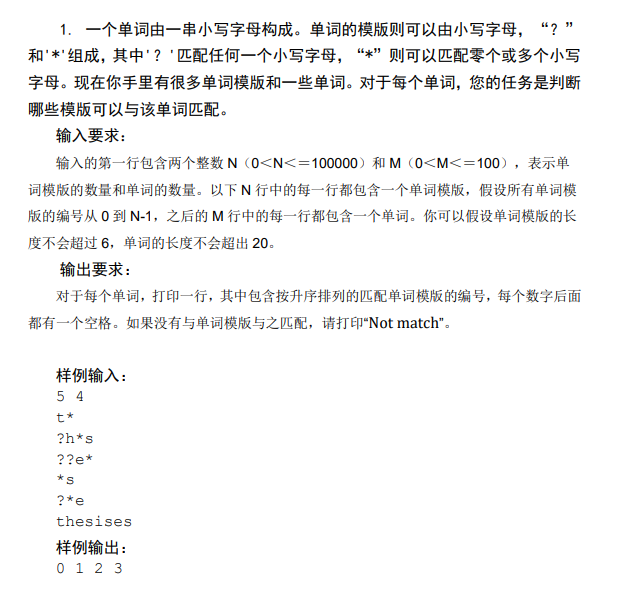
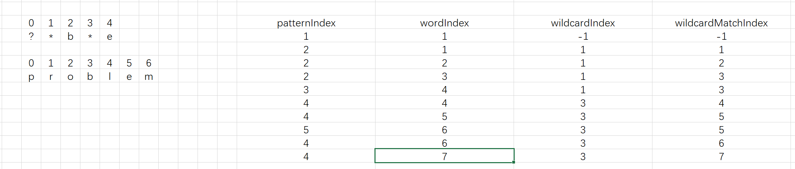
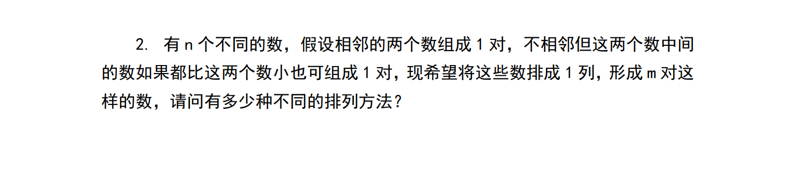
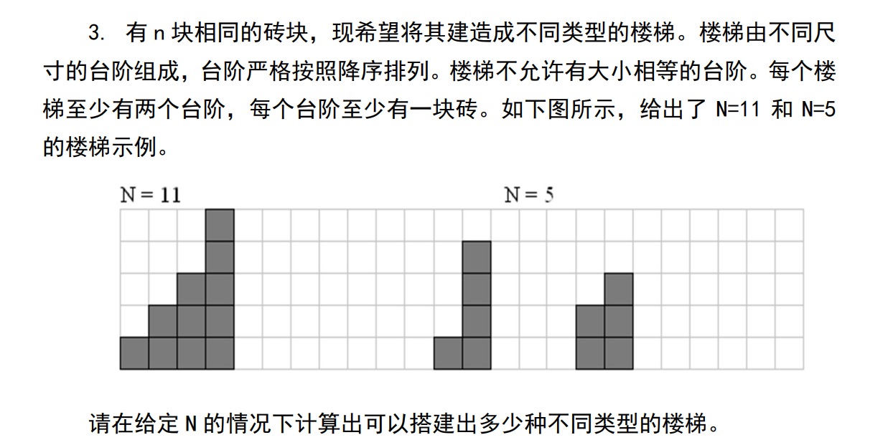
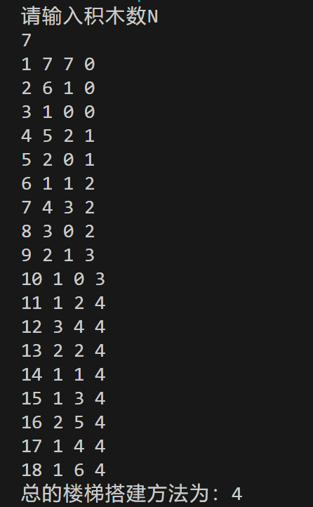

# Assignment_4

## Problem1



### input

> 图片中的输入应该是5 1 ···

读入两个整数N(int)，M(int)，分别表示匹配模式的数量和单词的数量

读入M行，每行对应一个匹配模式，匹配模式用 vector<string> patterns 存储

读入N行，每行对应一个待匹配的单词，单词用 vector<string> words 存储

### output

对于每个单词，打印一行，其中包含按升序排列的匹配单词模版的编号，每个数字后面

都有一个空格。如果没有与单词模版与之匹配，请打印“Not match”

### algorithm solution idea

这个算法的求解思想主要是通过遍历单词和模板中的字符，并根据匹配规则逐步进行匹配。

遍历单词和模板字符： 我们使用两个指针，分别指向单词和模板的当前字符。然后，我们逐个比较单词和模板中的字符。

处理普通字符和"?"通配符： 当单词和模板中的字符相同时，或者模板中的字符是 "?" 通配符时，我们继续向后移动指针，进行下一个字符的比较。

处理"*"通配符： 当模板中的字符是 "" 通配符时，我们记录下当前 "*" 的位置（即wildcardIndex），并记录下当前匹配到的单词位置（即wildcardMatchIndex）。然后我们继续向后移动模板指针，直到找到下一个非 "*" 的字符。

处理不匹配情况： 如果在匹配过程中遇到了不匹配的情况，我们会检查是否有 "*" 可以回退到，然后重新尝试匹配。

处理剩余情况： 最后，我们会处理模板和单词剩余的部分，确保模板中的所有字符都已经匹配完，并且单词中的字符也已经匹配完。

### pseuocode

```C++
bool IsMacth(string pattern, string word) {
    wordIndex = 0;
    patternIndex = 0;
    wildcardIndex = -1;
    wildcardMatchIndex = -1;

    while (字符未匹配结束) {
        if (模板未匹配结束 && (模板对应字符为通配符"?" || 模板字符和匹配字符一致)) {
            ++wordIndex;
            ++patternIndex;
        }
        else if (模板未匹配结束 && 模板字符为通配符"*") {
            wildcardIndex = patternIndex;
            wildcardMatchIndex = wordIndex;
            ++patternIndex;
        }
        else if (有通配符"*"可以回退) {
            patternIndex = wildcardIndex + 1;
            wordIndex = ++wildcardMatchIndex;
        }
        else return false
    }

    if pattern未匹配完且pattern的末尾全为"*" patternIndex = pattern.size()-1;
    return pattern匹配完 && wordIndex匹配完
}
```

### steps

> 样例1  
1 1  
?*b*e  
problem  



> 样例2  
1 1  
a*i?n*t  
assignment  


### code

```C++
#include <iostream>
#include <vector>
#include <string>

using namespace std;

// 检查单词是否与模板匹配的函数
bool isMatch(const string& word, const string& pattern) {
    int wordIndex = 0, patternIndex = 0;
    int wildcardIndex = -1, wildcardMatchIndex = -1;

    while (wordIndex < word.length()) {
        // 如果当前字符匹配，或者模板字符是 '?'
        if (patternIndex < pattern.length() && (pattern[patternIndex] == '?' || pattern[patternIndex] == word[wordIndex])) {
            ++wordIndex;
            ++patternIndex;
        }
        // 如果模板字符是 '*'
        else if (patternIndex < pattern.length() && pattern[patternIndex] == '*') {
            wildcardIndex = patternIndex;  // 记录 '*' 的位置
            wildcardMatchIndex = wordIndex;  // 记录当前匹配到的位置
            ++patternIndex;  // 跳过 '*'
        }
        // 如果当前字符不匹配且有 '*' 可以匹配
        else if (wildcardIndex != -1) {
            patternIndex = wildcardIndex + 1; // 回退到 '*' 的下一个位置
            wordIndex = ++wildcardMatchIndex; // 回退到上一个匹配的位置的下一个位置
        }
        // 如果当前字符不匹配且没有 '*' 可以匹配，且没有 '*' 的情况下，直接返回 false
        else return false;
    }

    // 如果模板字符还有剩余，但是单词已经匹配完了
    while (patternIndex < pattern.length() && pattern[patternIndex] == '*')
        ++patternIndex;

    // 如果单词字符还有剩余，但是模板已经匹配完了
    return wordIndex == word.length() && patternIndex == pattern.length();
}

int main() {
    int N, M;
    cin >> N >> M;

    vector<string> patterns(N);
    vector<string> words(M);

    // 读取模板
    for (int i = 0; i < N; ++i) cin >> patterns[i];

    // 读取单词
    for (int i = 0; i < M; ++i) cin >> words[i];

    // 对于每个单词，查找匹配的模板
    for (const auto& word : words) {
        vector<int> matches;

        // 遍历每个模板，检查是否匹配
        for (int i = 0; i < N; ++i) {
            if (isMatch(word, patterns[i]))
                matches.push_back(i);
        }

        // 输出匹配的模板编号
        if (matches.empty())
            cout << "Not match" << endl;
        else {
            for (int i : matches)
                cout << i << " ";
            cout << endl;
        }
    }

    return 0;
}
```

## Problem2



### Algorithm solution idea

### Pseuocode

### Steps

### Code

## Problem3



### Algorithm solution idea

算法使用深度优先搜索（DFS）来计算给定数量的积木能够构建多少种不同的楼梯搭建方法。

dfs 函数负责搜索所有可能的楼梯搭建方法。它的参数包括当前层级 x 和剩余积木数 block。
如果剩余积木数为零，表示已经使用完所有的积木，将搭建方法数量增加 1，并返回。
如果当前层级 x 小于 1，表示无法再搭建更高的楼梯，直接返回。
对于每个层级 x，尝试从 1 到 x - 1 中选择一个数作为当前层级的积木数，计算剩余积木数，然后递归调用 dfs 函数。
在递归调用后，要将剩余积木数恢复为原始值，以便在下一次迭代中继续尝试其他的积木分配方式。
在 main 函数中，接受用户输入积木数 N，然后调用 dfs 函数，计算出所有的楼梯搭建方法数量，并输出结果。

### Pseuocode

```C++
void dfs(int x, int block) {
    // 如果没有积木，增加一种方法
    if (block == 0) {
        ans++;
        return;
    }

    // 如果当前层级无法搭建更高的楼层，直接返回
    if (x < 1) return;

    for (int j = 1; j < x; j++) {
        if (block - (x - j) < 0) continue;
        //使用当前j个积木搭建当前层级，然后继续搜索下一层级
        dfs(x - j, block - (x - j));
    }
}
```

### Steps

程序的主要重点在于dfs函数，主函数起的作用是向dfs传入参数和接受结果，因此在验证的时候应当主要考虑dfs函数的正确性。设计下列样例
输入：11（即 N = 11）

算法执行过程中关键变量的值随dfs调用的变化



### Code

```C++
#include <iostream>
using namespace std;

int N, ans;
int count = 0;

void dfs(int x, int block) {
    cout << ++count << " " << x << " " << block << " "<< ans << endl;
    if (block == 0) {
        ans++;
        return;
    }

    if (x < 1) return;

    for (int j = 1; j < x; j++) {
        if (block - (x - j) < 0) continue;
        dfs(x - j, block - (x - j));
    }
}

int main() {
    cout << "请输入积木数N：" << endl;
    cin >> N;
    ans = 0;
    dfs(N, N);
    cout << "总的楼梯搭建方法为：" << ans << endl;

    return 0;
}
```


