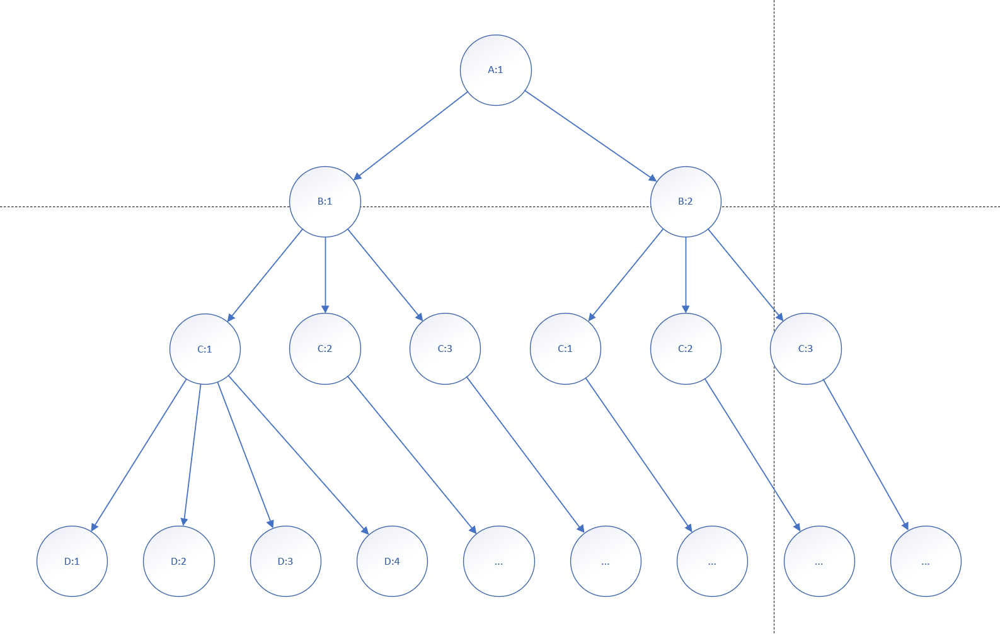
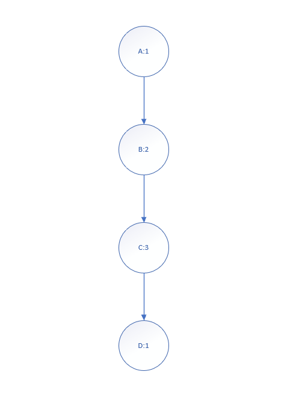
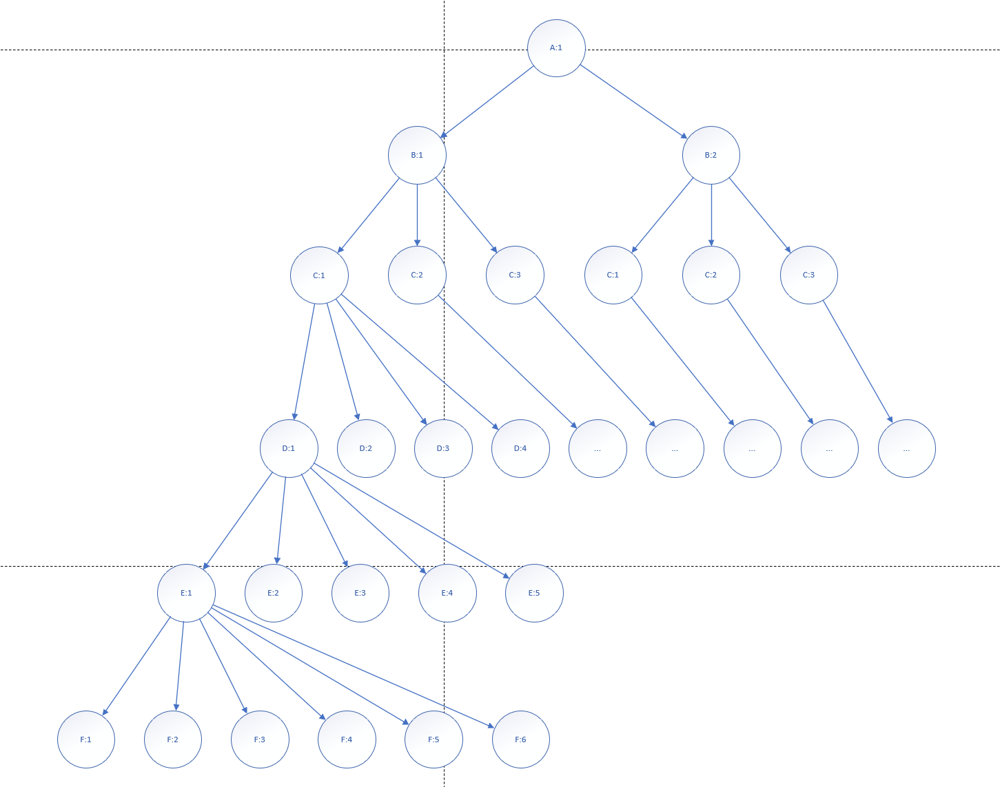
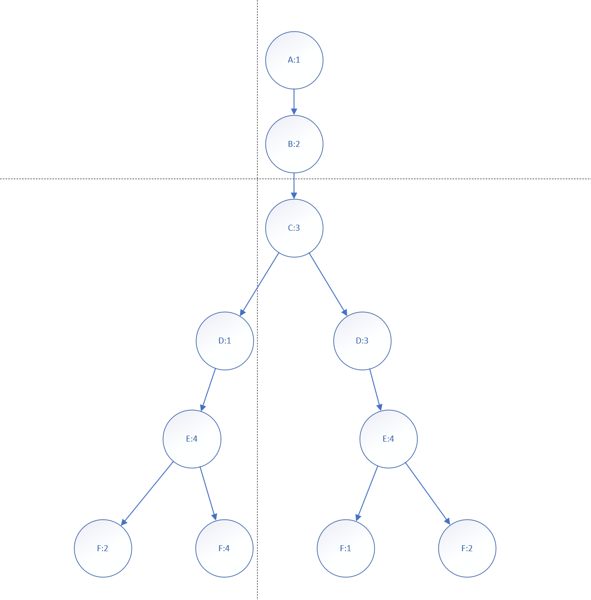

# 最少的通信频率

#### 题目 

在偏远地区，移动通信公司为了让更多的人能够用上移动电话，他们不得不修建更多的基站。相邻的基站为了不相互干扰，必须采用不同的频率来传输信号。由于无线电频谱是一种宝贵的资源，因此应尽量减少给定基站所需的频率资源。请编写一个程序，读取基站之间的邻接关系，并确定这些基站所需的最小频率数。

输入要求：
输入包括多组测试数据，每组测试数据包含若干基站之间的邻接关系。每组数据的第一行包含一个整数 n，表示基站的数量，如果 n 为 0，表述输入结束。基站的名称采用大写字母命名，从 A 开始，最多到 Z 结束。其后有若干行，每行第一个为基站的名称，后面紧跟一个冒号(:)，然后是与其相邻的基站的名称。如果一个基站与其它基站不相邻，则冒号后没有其它基站的名称，如 A：表示没有基站与 A 相邻。
输出要求：
对于每一组测试数据，输出一个整数，表示需要分配的频率数。

##### 样例输入
2  
A:  
B:  
4  
A:BC  
B:ACD  
C:ABD  
D:BC  
4  
A:BCD  
B:ACD  
C:ABD  
D:ABC  
0  

##### 样例输出：

1  
3  
4  

##### 要求
1. 画出在第 2 个样例输入时求解该问题的解空间树。（10 分）
2. 给出求解该问题的目标函数，约束条件。如果存在界函数，则给出对应的界函数的求解方法。（20 分）
3. 画出采用回溯法在第 2 个样例输入时的搜索空间树。（20 分）
4. 编写求解该问题的完整程序。（30 分）
5. 设计一组测试数据对上述程序进行验证，给出验证过程。（20 分）

#### 解空间树



#### 目标函数、约束函数、限界函数

##### 目标函数

所有基站全部被着色 && freqCnt最小

##### 约束函数

为当前基站idx选择的频率f不能与idx相邻的基站相同

##### 限界函数

已经使用的频率数curCnt > 最小频率数FreqCnt则不再继续搜索

#### 搜索空间树



#### 伪代码

##### main函数伪代码

```
变量    map:vector<vector<int>>,基站相邻情况; sites:vecotr<int>,基站所用频率; result:int, 最小的频率数;
输入    n:int,基站个数; 
输出    freqCnt:最小的频率使用数;
main() {
    读入n;
    init(n);
    Backtracking(0,0);
}
```

##### init伪代码

```
变量    map:vector<vector<int>>,基站相邻情况; sites:vecotr<int>,基站所用频率;
输入    n:int,基站个数; 
输出    map:vector<vector<int>>,基站相邻情况; sites:vecotr<int>,基站所用频率;
init(n) {
    map初始化(n*n,0);
    sites初始化为(n,0);
    i from 0 to n-1 : {
        j from i+1 to n-1 : {
            map[i][j] = map[j][i] = 1;
        }
    }
}
```

##### BackTracking伪代码

```
输入：startIndex:当前需要确定频率的城市; curCnt:当前使用的频率数
输出：
BackTracking(startIndex, curCnt)
{
    如果图全部着色 : {
        result = max(result, curCnt);
        return;
    }
    int flag = false;
    freq from 1 to curCnt: {
        如果与i相邻的基站没使用过freq: {
            sites[startIndex] = freq;
            flag = true;
            BackTracking(startIndex+1, curCnt);
            sites[startIndex] = 0;
        }
    }
    如果当前基站已经使用的频率都无法分配给当前基站 : {
        site[i] = curCnt+1;
        BackTrack(startIndex+1, curCnt+1);
    }
}
```

#### 完整程序

```cpp
#include <iostream>
#include <vector>
#include <string>

using namespace std;

int n; // 基站数量
int result; // 频率的最小使用数
vector<vector<int>> map(n, vector<int>(n, 0));
vector<int> sites(n, 0);

void init() {
    map.assign(n, vector<int>(n, 0));
    sites.assign(n, 0);
    for (int i = 0; i < n; ++i) {
        string str;
        cin >> str;
        if (str.size() == 2) continue;
        for (int j = 2; j < str.size(); ++j) 
            map[i][str[j]-'A'] = map[str[j]-'A'][i] = 1;
    }
}

void BackTracking(int startIndex, int curCnt) {
    if (startIndex == sites.size()) {
        result = max(result, curCnt);
        return;
    }
    vector<int> freqs(curCnt+1, 0);

    //将当前基站可以用的频率做标记
    for (int i = 0; i < sites.size(); ++i) 
        if (map[startIndex][i] == 1 && sites[i] != 0)
            freqs[sites[i]] = 1;

    int flag = false;
    for (int i = 1; i <= curCnt; ++i) {
        if (freqs[i] == 0) {
            flag = true;
            sites[startIndex] = i;
            BackTracking(startIndex+1, curCnt);
            sites[startIndex] = 0;
        }
    }

    // 已分配的频率都不可用
    if (flag == false) {
        sites[startIndex] = curCnt+1;
        BackTracking(startIndex+1, curCnt+1);
    }
}

int main() {
    cin >> n;
    init();
    BackTracking(0,0);
    cout << result;
}
```

#### 样例验证

##### Input

6
A:BCE
B:ACE
C:ABE
E:ABC
D:CF
F:DE


######## Output

4

##### 解空间树



##### 搜索空间树

