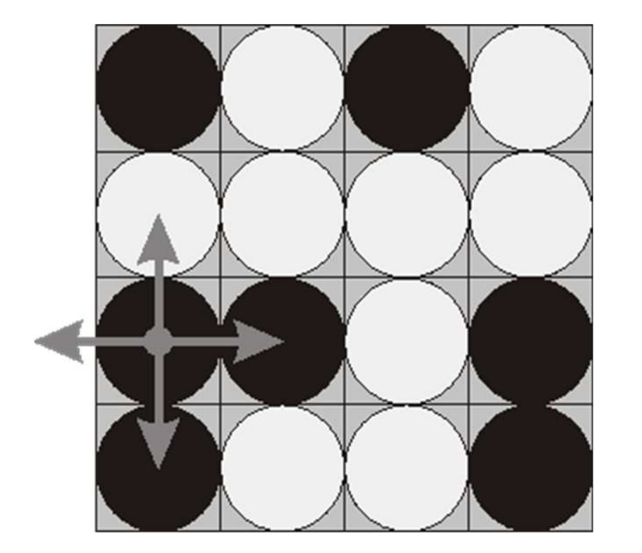

# 翻转棋子

#### 题目

在一个长方形的 4x4 场地上摆放了 16 个正方形的双面棋子。每个棋子的一面是白色的，另一面是黑色的。每一轮你可以翻转 3 到 5 块，从而将其上侧的颜色从黑色变为白色，反之亦然。每轮都会根据以下规则选择要翻转的棋子：
（1）选择 16 个棋子中的任意一个。
（2）将该棋子以及相邻的上、下、左、右的棋子反转。
比如下面左边的棋盘，以右边的字符串来表示，其中 b 表示该棋子黑色朝上，w 表示该棋子白色朝上。

当对第 1 列的第 3 个棋子进行上述操作时，得到下面的棋子。

请设计算法采用最少的步骤使整个棋盘上的棋子全部变白或者变黑。

输入要求：
输入由 4 行组成，每行有 4 个字符“w”或“b”，表示棋盘上棋子的颜色。

输出要求：
在输出一个整数，也就是从某个位置开始使棋盘所有棋子变白或者变黑所需的最小步骤。
如果刚开始就满足条件，则输出 0；如果不可能实现目标，则输出-1。

##### 样例输入

bwwb
bbwb
bwwb
bwww

##### 样例输出

4

##### 要求

（1） 给出样例输入时的解空间树。（10 分）
（2） 给出求解该问题时的目标函数，约束条件以及界函数。（20 分）
（3） 给出样例输入时采用回溯法求解该问题时的搜索空间树。（20 分）
（4） 编写完整程序采用回溯法求解该问题。（30 分）
（5） 设计一组测试数据，验证上述程序的正确性，给出验证过程。（20 分）

#### 解空间树

