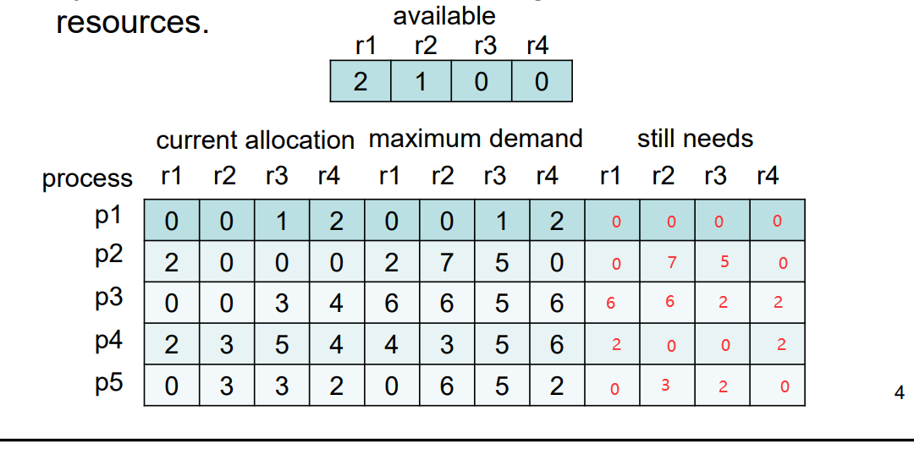
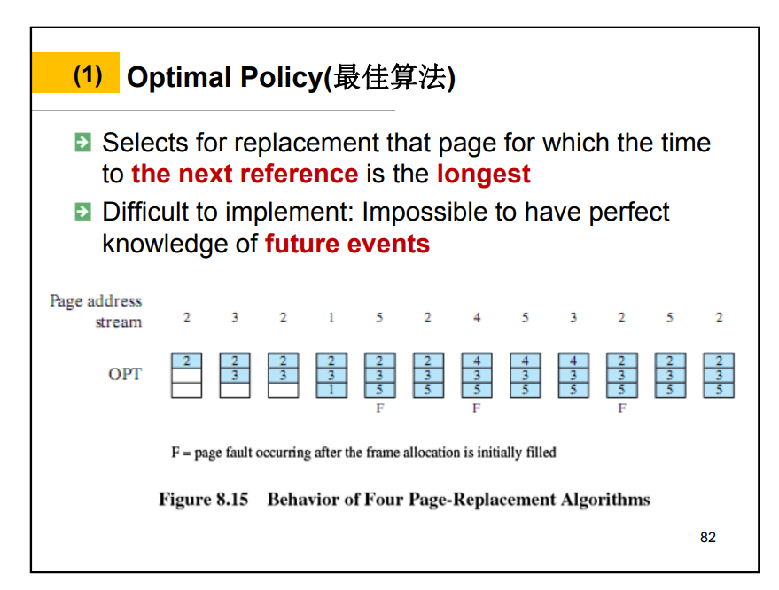
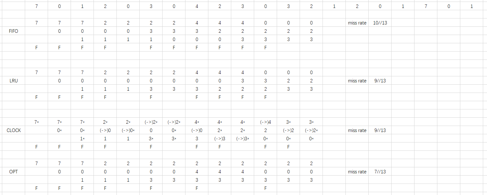

# t

## 2.1

Y

## 3.1

Y

## 3.2

Y

* time:22
    * P1:Blocked
    * P3:Ready
    * P5:Running
    * P7:Blocked
    * P8:Ready
* time:37
    * P1:Ready
    * P3:Ready
    * P5:Blocked
    * P7:Blocked
    * P8:Running
* time:47
    * P1:Ready
    * P3:Ready
    * P5:Blocked
    * P7:

## 4.5

Y

## banoos cross the cayon

> Introduction

### writer and reader

```c++
semaphore rw = 1；// 读写进程互斥访问
semaphore countmutex = 1; // count的互斥访问
int count = 0; // 读进程的数量

writer(){
    while(1) {
        P(rw);
        //临界区代码
        V(rw);
    }
}

reader(){
    while(1) {
        P(countmutex);
        if (count == 0)
            P(rw);
        count++;
        V(countmutex);
        //临界区代码
        P(countmutex);
        count--;
        if (count == 0)
            V(rw)
        V(countmutex);
    }
}
```

### Code

```c++
semaphore mutex = 1;
semaphore e2wmutex = 1, w2emutex = 1;
int e2wc = 0,w2ec = 0;

e2w() {
    P(e2wmutex);
    if (e2wc == 0)
        P(mutex);
    e2wc++;
    V(e2wmutex);
    //e2w
    P(e2wmutex);
    e2wc--;
    if (e2wc == 0)
        V(mutex);
    V(e2wmutex);
}

w2e() {
    // 同理
}
```
## 6.5


2 1 0 0 p1
2 1 1 2 free(p1)
0 1 1 0 p4
4 4 6 6 free(p4)
4 1 4 6 p5
4 7 9 8 free(p5)
4 0 4 8 p2
6 7 9 8 free(p2)

## 6.6

Y

## 7.12

a. 10+16=26
b. 2^10
c. 32-10=22,physical address calculated by physical memory.
d. 2^16,The page table has an entry for each page in the logical address space.
e. 23

## 8.1

Y

## 8.4



